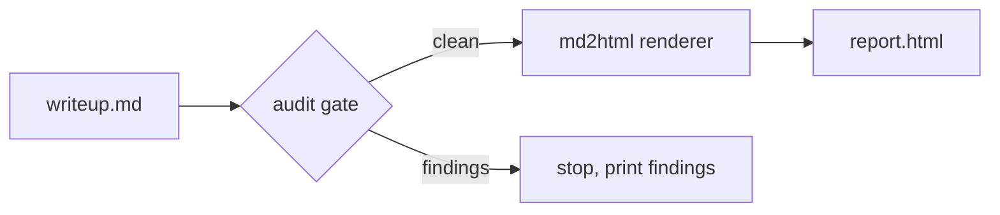

# Example Session Report

## TL;DR

This is a minimal example document that demonstrates the lockstep contract
between technical-session-writeup and md2html. It passes the write-up audit
gate and renders to self-contained HTML with a working table of contents.

## Why This Matters

Without a shared contract, a write-up that passes the audit gate can still
produce HTML with dead TOC links and unstyled math, and a report that
renders beautifully can fail the write-up structure rules. The lockstep
rules make one document satisfy both gates at once.

## Background: What You Need to Know First

Markdown is the canonical artifact; HTML is a derived render. The write-up
gate checks document structure and rules; the renderer checks syntax
(Mermaid, math, code fences) and produces the final HTML.

## Section 1: The Pipeline

Why this matters: The chain gate is the heart of lockstep. If it rendered
before auditing, a document with zombie-problem narration would ship as
HTML with the detours visible to readers.

**Intuitively.** Think of it as an inspector at a factory gate: every
document walks past the inspector before it enters the rendering line.
If the inspector finds a defect, the document stops there — no half-made
product leaves the factory.

**Technically.** `pipeline.mjs run` spawns `audit_writeup.py <md>` first;
on exit code 1 it prints findings and exits without invoking the renderer.
On exit 0 it spawns `md2html.mjs <md>` with `stdio: inherit` and propagates
the renderer's exit code.



## Section 2: Math and Code

Why this matters: The HTML layer adds vibrancy the Markdown layer cannot
express. Math is typeset by KaTeX at render time; code is highlighted by
Shiki with light/dark themes.

**Intuitively.** The raw text carries instructions; the renderer is the
printer that turns those instructions into ink, typefaces, and color.

**Technically.** The integral below is typeset by KaTeX at build time;
the fenced block after it is tokenized by Shiki, so the output needs no
runtime JS for highlighting.

$$
\int_0^1 x\,dx = \tfrac{1}{2}
$$

```python
def double(x: float) -> float:
    return x * 2
```

## Results

The document passed both gates on a clean pipeline run. The rendered HTML
is self-contained: no external references, theme toggle, TOC sidebar.

## What's Next

Extend the example with an XY chart block once a Python environment with
`xy` is available; verify the iframe renders in both themes.

## Appendix A: Corrections and Dead Ends

None.

## Appendix B: Glossary

None.

## Appendix C: Reproducing the Figures

None.
